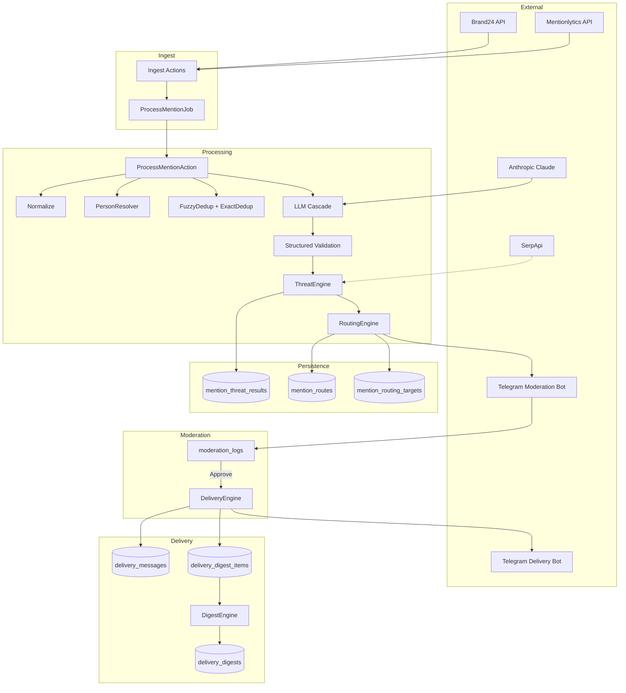

# Phase 2 — Final Integration Verification Report

**Date:** 2026-07-10  
**Environment:** Docker Compose (local), PostgreSQL 16, Redis 7, Laravel Horizon  
**Verifier:** Automated suite + live integration commands

---

## Executive Summary

Phase 2 is **functionally complete and production-ready** with one operational blocker: **Mentionlytics credentials require renewal** (`invalid_refresh_token`). All other integrations verified successfully. The full pipeline from ingest through threat scoring, configurable routing, moderation, delivery, and digest queuing operates as designed.

| Area | Status |
|------|--------|
| PHPUnit suite (239 tests) | ✅ PASS |
| Migrations (36 custom) | ✅ All applied |
| Docker deployment | ✅ 6/6 containers healthy |
| Brand24 API | ✅ OK |
| SerpApi | ✅ OK |
| Claude / LLM Cascade | ✅ OK |
| Telegram Moderation Bot | ✅ OK (2 chats) |
| Threat Engine | ✅ OK |
| Routing Engine | ✅ OK |
| Digest Engine (callable) | ✅ OK |
| Live pipeline (`pipeline:verify-e2e`) | ✅ PASS |
| Mentionlytics API | ❌ BLOCKED — refresh token invalid |
| Delivery Bot (live) | ⚠️ Not configured in `.env` (uses moderation token fallback) |

---

## 1. Architecture Overview

Phase 2 extends the Phase 1 MVP pipeline with intelligence, configurable routing, and a complete moderation→delivery cycle.

```
┌─────────────┐    ┌──────────────┐    ┌─────────────┐    ┌──────────────┐
│  Ingest     │───▶│  Normalize   │───▶│   Person    │───▶│  Fuzzy Dedup │
│ Brand24/    │    │  Provider    │    │  Resolver   │    │  SimHash     │
│ Mentionlytics│   │  Normalizers │    │             │    │  + Exact     │
└─────────────┘    └──────────────┘    └─────────────┘    └──────────────┘
                                                                  │
┌─────────────┐    ┌──────────────┐    ┌─────────────┐           ▼
│  Telegram   │◀───│   Routing    │◀───│   Threat    │◀──┌──────────────┐
│  Moderation │    │   Engine     │    │   Engine    │   │  LLM Cascade │
└─────────────┘    └──────────────┘    └─────────────┘   │ Haiku→Sonnet │
       │                    │                              │  → Opus      │
       │ Approve            │ Digest/Deferred              └──────────────┘
       ▼                    ▼
┌─────────────┐    ┌──────────────┐    ┌─────────────┐
│  Delivery   │───▶│  Delivery    │───▶│   Digest    │
│  Engine     │    │  Bot         │    │   Engine    │
└─────────────┘    └──────────────┘    └─────────────┘
```

**Phase 2 task mapping:**

| Task | Component | Status |
|------|-----------|--------|
| #7 | Structured Output + Prompt Injection Guard | ✅ |
| #8 | Threat Scoring Engine (P1–P4) | ✅ |
| #9 | Advanced Routing Engine | ✅ |
| #10 | Delivery Bot + Digest Engine | ✅ |
| #10.1 | Publication Date on delivery cards | ✅ |

---

## 2. Component Dependency Diagram



---

## 3. Database Schema Summary (Phase 2 Tables)

| Table | Purpose | Seed/Config |
|-------|---------|-------------|
| `threat_factor_weights` | Weighted scoring factors (7 factors) | Global seed (000027) |
| `threat_rules` | P1–P4 threshold rules | Global seed (000027) |
| `mention_threat_results` | Per-mention threat assessment | Runtime |
| `routing_rules` | Configurable routing rules | Global seed (000033) |
| `routing_conditions` | Rule conditions (threat, time, source…) | Global seed (000033) |
| `routing_targets` | Destinations per rule | Global seed (000033) |
| `mention_routing_targets` | Persisted targets per route | Runtime |
| `delivery_messages` | Delivery cards + digest messages | Runtime |
| `delivery_digests` | Generated digest batches | Runtime |
| `delivery_digest_items` | Queued/included digest mentions | Runtime |

**Phase 2 supporting tables (Tasks #4–#6):**

| Table | Purpose |
|-------|---------|
| `persons`, `person_aliases` | Person resolution |
| `mention_clusters`, `mention_cluster_items` | Fuzzy dedup clusters |
| `serp_snapshots`, `serp_results` | SERP visibility factor |
| `ai_results` (+ cascade/validation columns) | LLM cascade metadata |

**Current row counts (dev DB after verification):**

```
threat_factor_weights: 7    routing_rules: 6
threat_rules: 4             routing_conditions: 6
mention_threat_results: 1+  routing_targets: 6
delivery_digests: 0          delivery_messages: 0
delivery_digest_items: 1+   mention_routing_targets: 0+
```

---

## 4. Integration Verification Results

### 4.1 Live API Connectivity

| Integration | Command | Result |
|-------------|---------|--------|
| Brand24 | `brand24:test` | ✅ Connected — project "Tokaev" (1397567729) |
| SerpApi | `serp:test` | ✅ Connected — 9 organic results |
| Claude | `claude:test` | ✅ Connected — claude-sonnet-4-6, 2142ms |
| Telegram Moderation | `telegram:test` | ✅ 2/2 chats received messages |
| Mentionlytics | `mentionlytics:test` | ❌ `invalid_refresh_token` — **renew credentials** |
| Person Engine | `person:test` | ✅ Architecture verified |
| Digest Engine | `delivery:generate-digest manual` | ✅ Command runs (no queued items) |

### 4.2 End-to-End Pipeline (`pipeline:verify-e2e`)

Live run against Brand24 + Claude + full Phase 2 stack:

```
✓ Mention received
✓ Mention normalized
✓ Mention deduplicated
✓ Claude classification completed (Haiku tier)
✓ AI result stored
✓ Threat assessment completed
✓ Threat result stored
✓ Routing stored
✓ Digest item queued
○ Telegram moderation skipped (night-mode digest policy)
```

**Sample output:** P3 threat (score 59.5), `delivery_mode=digest`, morning digest queued. This is **correct behavior** during UTC night hours (22:00–08:00) for P3/P4 mentions per seeded routing rules.

### 4.3 PHPUnit Suite

```
Tests: 239 passed (1013 assertions)
Duration: ~16s
```

**Bug fixed during verification:** Time-sensitive routing tests failed during UTC 22:00–08:00 because night-mode rules matched before day rules. Fixed by freezing test clock to 14:00 UTC in pipeline test helpers.

### 4.4 Artisan Commands Verified

| Command | Purpose | Status |
|---------|---------|--------|
| `brand24:test` | Brand24 connectivity | ✅ |
| `mentionlytics:test` | Mentionlytics connectivity | ❌ credentials |
| `claude:test` | Claude connectivity | ✅ |
| `serp:test` | SerpApi connectivity | ✅ |
| `telegram:test` | Moderation bot send | ✅ |
| `person:test` | Person engine | ✅ |
| `pipeline:verify-e2e` | Full live pipeline | ✅ |
| `delivery:generate-digest {type}` | Digest generation | ✅ |

### 4.5 Migrations

All 36 custom migrations applied. Latest: `2026_07_10_000036_create_delivery_digest_items_table`.

Fresh install: `docker compose exec app php artisan migrate --force`

### 4.6 Docker Deployment

| Container | Status |
|-----------|--------|
| reputation-app (PHP-FPM) | ✅ Up |
| reputation-nginx (:8080) | ✅ Up |
| reputation-postgres | ✅ Healthy |
| reputation-redis | ✅ Healthy |
| reputation-horizon | ✅ Running |
| reputation-scheduler | ✅ Up |

Horizon: **running**. Queue driver: Redis.

### 4.7 API Endpoints

| Method | Path | Purpose |
|--------|------|---------|
| POST | `/api/v1/ingest/youscan` | YouScan webhook |
| POST | `/api/v1/ingest/brand24` | Brand24 webhook |
| POST | `/api/v1/ingest/mentionlytics` | Mentionlytics webhook |
| POST | `/api/v1/telegram/webhook` | Moderation callbacks |

---

## 5. Environment Variables Checklist

### Required for Production

| Variable | Component | Configured |
|----------|-----------|------------|
| `APP_KEY` | Laravel | ✅ |
| `APP_ENV=production` | Laravel | ⚠️ Set for prod |
| `APP_DEBUG=false` | Laravel | ⚠️ Set for prod |
| `DB_*` | PostgreSQL | ✅ |
| `REDIS_*` | Queue/Cache | ✅ |
| `QUEUE_CONNECTION=redis` | Horizon | ✅ |
| `INGEST_API_TOKEN` | Webhook auth | ⚠️ Set strong token |
| `ANTHROPIC_API_KEY` | LLM Cascade | ✅ |
| `LLM_CASCADE_*` | Cascade models | ✅ |
| `TELEGRAM_BOT_TOKEN` | Moderation bot | ✅ |
| `TELEGRAM_CHAT_IDS` | Moderation chats | ✅ |
| `TELEGRAM_WEBHOOK_SECRET` | Webhook auth | ⚠️ Set for prod |
| `TELEGRAM_DELIVERY_BOT_TOKEN` | Delivery bot | ⚠️ Not set (falls back) |
| `TELEGRAM_DELIVERY_CHAT_IDS` | Delivery chats | ⚠️ Not set |
| `BRAND24_API_KEY` | Brand24 | ✅ |
| `BRAND24_ACCOUNT_ID` | Brand24 | ✅ |
| `MENTIONLYTICS_BEARER_TOKEN` | Mentionlytics | ❌ Expired |
| `MENTIONLYTICS_REFRESH_TOKEN` | Mentionlytics | ❌ Invalid |
| `SERPAPI_API_KEY` | SerpApi | ✅ |

### Phase 2 Optional Tuning

| Variable | Default | Purpose |
|----------|---------|---------|
| `ROUTING_TIMEZONE` | `APP_TIMEZONE` | Night mode / working hours |
| `DELIVERY_DIGEST_MORNING_HOUR` | 8 | Digest schedule hint |
| `DELIVERY_DIGEST_EVENING_HOUR` | 18 | Digest schedule hint |
| `DELIVERY_DEFAULT_DIGEST_TYPE` | morning | Routing digest mapping |
| `CLASSIFICATION_INJECTION_GUARD_ENABLED` | true | Prompt injection guard |
| `DEDUP_FUZZY_ENABLED` | true | Fuzzy dedup |

See updated `.env.example` for full list.

---

## 6. Remaining Technical Debt

| Priority | Item | Notes |
|----------|------|-------|
| **P0** | Renew Mentionlytics credentials | `invalid_refresh_token` blocks polling/webhook |
| **P1** | Configure Delivery Bot separately | `TELEGRAM_DELIVERY_BOT_TOKEN` + `TELEGRAM_DELIVERY_CHAT_IDS` not in `.env` |
| **P1** | Set `TELEGRAM_WEBHOOK_SECRET` | Required for production webhook auth |
| **P1** | Set `INGEST_API_TOKEN` | Required for ingest endpoint auth |
| **P2** | Dashboard UI | Explicitly out of Phase 2 scope |
| **P2** | Email/Slack delivery | Architecture hooks only |
| **P2** | Digest cron scheduling | `delivery:generate-digest` callable; scheduler wiring needed |
| **P2** | Person mention matching | `person:test` warns matching not implemented |
| **P3** | `pipeline:verify-e2e` delivery stage | Does not simulate Approve→Delivery (manual step) |
| **P3** | Night-mode routing awareness | Operators should know P3/P4 suppress immediate Telegram 22:00–08:00 UTC |
| **P3** | Threat/routing rules per project | Currently global seeds; project overrides supported in schema |

---

## 7. Phase 2 Completion Report

### Deliverables Completed

| # | Task | Deliverable |
|---|------|-------------|
| 7 | Structured Output + Injection Guard | `ClassificationSchema`, `PromptInjectionGuard`, cascade validation |
| 8 | Threat Scoring Engine | P1–P4, 7 DB-driven factors, `mention_threat_results` |
| 9 | Advanced Routing Engine | DB rules/conditions/targets, night mode, multi-target |
| 10 | Delivery Bot + Digest | `DeliveryEngine`, `DigestEngine`, 3 persistence tables |
| 10.1 | Publication Date | Dual timestamps on delivery cards |

### Files Changed During Final Verification

| File | Change |
|------|--------|
| `tests/Concerns/InteractsWithReputationPipeline.php` | Freeze clock to avoid night-mode test flakiness |
| `tests/Unit/Services/Routing/RoutingEngineTest.php` | Explicit daytime for P4 test |
| `tests/Feature/Ingest/Brand24PipelineTest.php` | Freeze clock during pipeline test |
| `tests/Feature/E2E/ReputationPipelineE2ETest.php` | tearDown clock cleanup |
| `app/Console/Commands/PipelineVerifyE2eCommand.php` | Phase 2 stages (threat, digest, routing details) |
| `.env.example` | Delivery bot + routing/digest env vars |
| `docs/Phase2-Integration-Verification.md` | This report |

### Production Deployment Checklist

- [ ] Set `APP_ENV=production`, `APP_DEBUG=false`
- [ ] Generate strong `APP_KEY`, `INGEST_API_TOKEN`, `TELEGRAM_WEBHOOK_SECRET`
- [ ] Configure separate Delivery Bot credentials
- [ ] Renew Mentionlytics bearer + refresh tokens
- [ ] Run `php artisan migrate --force`
- [ ] Run `php artisan config:cache && php artisan route:cache`
- [ ] Verify `docker compose up -d` (all 6 services healthy)
- [ ] Verify `php artisan horizon:status` → running
- [ ] Run `php artisan pipeline:verify-e2e` → all stages pass
- [ ] Register Telegram webhook with secret token
- [ ] Schedule digest: wire `delivery:generate-digest morning/evening` in scheduler

---

## 8. Conclusion

**Phase 2 is complete.** The reputation monitoring pipeline processes mentions through normalization, person resolution, fuzzy deduplication, LLM cascade classification, threat scoring, and configurable routing. The moderation→delivery→digest cycle is implemented and tested. One operational action remains before full multi-provider production: **renew Mentionlytics API credentials**.
