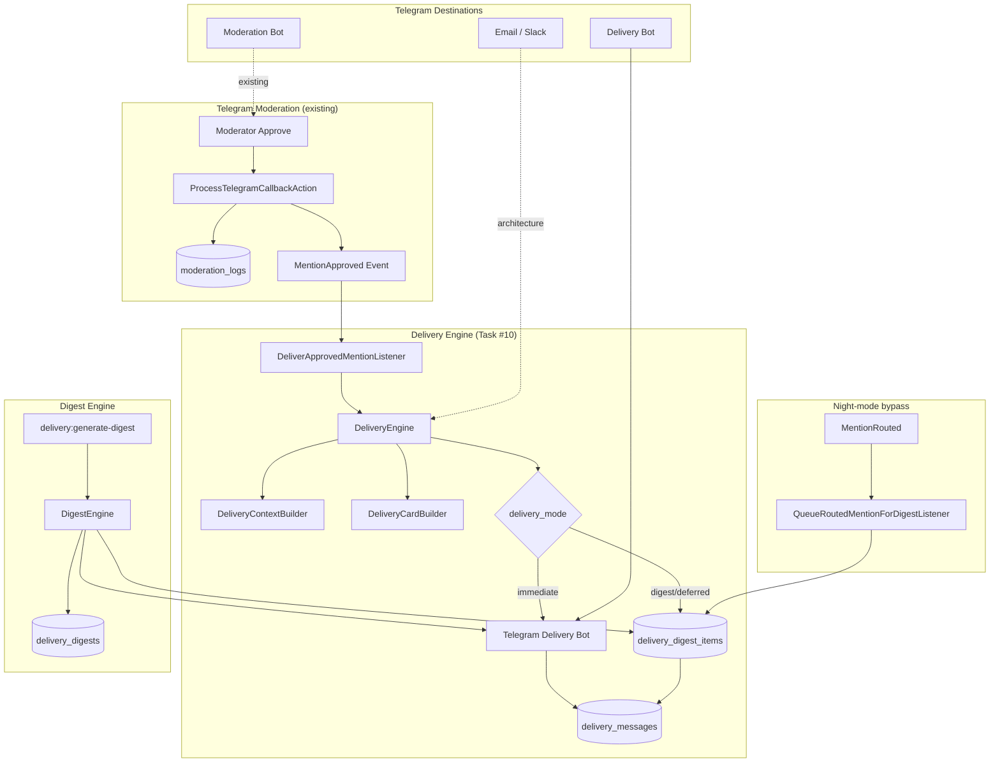
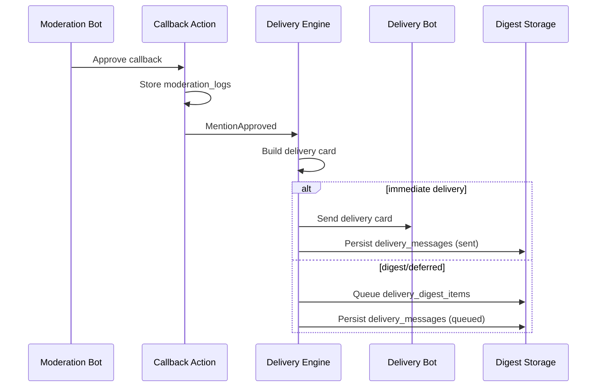

# Task #10 — Delivery Bot & Digest Engine

## Architecture Diagram



## Approval → Delivery Flow



## Database Schema

| Table | Purpose |
|-------|---------|
| `delivery_messages` | Individual delivery cards and digest aggregate messages |
| `delivery_digests` | Generated digest batches per project |
| `delivery_digest_items` | Queued/included mentions in a digest |

## Delivery Card Fields

Each card includes: Person, Threat Level, Source, Summary, Original URL, Sentiment, Severity, SERP Position, Cluster Size, Timestamp.

## Configuration

`config/delivery.php` — class references and Telegram destination settings only.

| Env Variable | Purpose |
|--------------|---------|
| `TELEGRAM_DELIVERY_BOT_TOKEN` | Delivery bot token |
| `TELEGRAM_DELIVERY_CHAT_IDS` | Delivery destination chat IDs (comma-separated) |
| `TELEGRAM_MODERATION_BOT_TOKEN` | Optional separate moderation bot |
| `TELEGRAM_MODERATION_CHAT_IDS` | Optional moderation chat override |
| `DELIVERY_DIGEST_MORNING_HOUR` | Morning digest schedule hint |
| `DELIVERY_DIGEST_EVENING_HOUR` | Evening digest schedule hint |

No hardcoded chat IDs in code.

## Scheduler Integration

Digest generation is callable via Artisan (no cron infrastructure):

```bash
php artisan delivery:generate-digest morning --project=1
php artisan delivery:generate-digest evening
php artisan delivery:generate-digest manual --project=2
```

## Verification Report

**Date:** 2026-07-10  
**Environment:** Docker

### Test Results

```
Tests: 235 passed (996 assertions)
Duration: ~13s
```

### Scenario Coverage

| Scenario | Test | Result |
|----------|------|--------|
| Approve → delivery | `DeliveryPipelineTest::it_delivers_approved_mention_to_delivery_bot` | PASS |
| Reject → no delivery | `DeliveryPipelineTest::it_does_not_deliver_when_moderation_is_rejected` | PASS |
| Immediate delivery card | `DeliveryEngineTest::it_sends_delivery_card_after_approval` | PASS |
| Digest queue on approve | `DeliveryEngineTest::it_queues_digest_delivery_when_route_requires_digest` | PASS |
| Telegram failure handling | `DeliveryEngineTest::it_marks_delivery_as_failed_when_telegram_rejects_request` | PASS |
| Morning digest generation | `DigestEngineTest::it_generates_and_sends_morning_digest_for_project` | PASS |
| Multiple projects | `DigestEngineTest::it_generates_digests_for_multiple_projects` | PASS |
| Digest failure handling | `DigestEngineTest::it_marks_digest_as_failed_when_delivery_bot_is_unavailable` | PASS |
| Artisan command | `DigestGenerationCommandTest::it_generates_digest_via_artisan_command` | PASS |

### Not Implemented (per spec)

- Dashboard
- Email delivery
- Slack delivery
- Push notifications
- Cron infrastructure

## Changed Files

### Migrations
- `database/migrations/2026_07_10_000034_create_delivery_digests_table.php`
- `database/migrations/2026_07_10_000035_create_delivery_messages_table.php`
- `database/migrations/2026_07_10_000036_create_delivery_digest_items_table.php`

### Enums
- `app/Enums/DeliveryChannel.php`
- `app/Enums/DeliveryMessageStatus.php`
- `app/Enums/DeliveryDigestStatus.php`
- `app/Enums/DeliveryDigestItemStatus.php`
- `app/Enums/DigestType.php`
- `app/Enums/TelegramDestination.php`

### Models
- `app/Models/DeliveryMessage.php`
- `app/Models/DeliveryDigest.php`
- `app/Models/DeliveryDigestItem.php`
- `app/Models/Mention.php` (relations)

### DTOs
- `app/DTO/DeliveryContextDTO.php`
- `app/DTO/DeliveryCardDTO.php`
- `app/DTO/DeliveryResultDTO.php`

### Contracts
- `app/Contracts/DeliveryEngineInterface.php`
- `app/Contracts/DigestEngineInterface.php`
- `app/Contracts/DeliveryContextBuilderInterface.php`
- `app/Contracts/DeliveryCardBuilderInterface.php`
- `app/Contracts/DeliveryMessageStorageInterface.php`
- `app/Contracts/DeliveryDigestStorageInterface.php`
- `app/Contracts/TelegramDestinationNotifierInterface.php`

### Services
- `app/Services/Delivery/DeliveryEngine.php`
- `app/Services/Delivery/DigestEngine.php`
- `app/Services/Delivery/DeliveryContextBuilder.php`
- `app/Services/Delivery/DeliveryCardBuilder.php`
- `app/Services/DeliveryMessageStorage.php`
- `app/Services/DeliveryDigestStorage.php`
- `app/Services/TelegramDestinationNotifier.php`
- `app/Support/TelegramDestinationConfig.php`

### Actions / Events / Listeners / Commands
- `app/Actions/DeliverApprovedMentionAction.php`
- `app/Actions/GenerateProjectDigestAction.php`
- `app/Actions/QueueRoutedMentionForDigestAction.php`
- `app/Events/MentionDelivered.php`
- `app/Events/DigestDelivered.php`
- `app/Listeners/DeliverApprovedMentionListener.php`
- `app/Listeners/QueueRoutedMentionForDigestListener.php`
- `app/Console/Commands/GenerateDeliveryDigestCommand.php`
- `app/Providers/EventServiceProvider.php`
- `app/Providers/AppServiceProvider.php`
- `config/delivery.php`

### Tests
- `tests/Concerns/CreatesDeliverableMention.php`
- `tests/Unit/Services/Delivery/DeliveryEngineTest.php`
- `tests/Unit/Services/Delivery/DigestEngineTest.php`
- `tests/Feature/Delivery/DeliveryPipelineTest.php`
- `tests/Feature/Delivery/DigestGenerationCommandTest.php`
