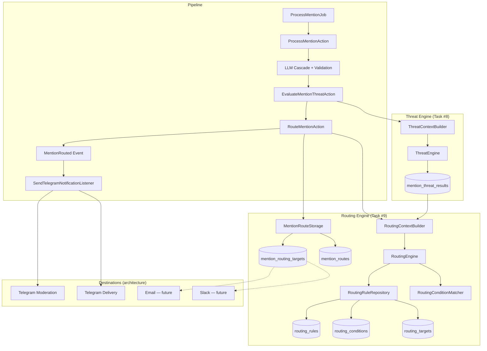
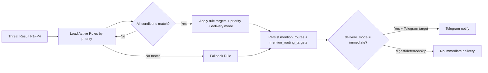

# Task #9 — Advanced Routing Engine

## Architecture Diagram



## Decision Flow



## Database Schema

| Table | Purpose |
|-------|---------|
| `routing_rules` | Configurable rules: priority, delivery mode, auto_skip, skip_moderation |
| `routing_conditions` | Rule conditions: threat_level, source, person, time, night_mode, working_hours |
| `routing_targets` | Rule destinations: telegram_moderation, telegram_delivery, email, slack |
| `mention_routes` | Persisted decision per mention (extended with rule_id, delivery_mode) |
| `mention_routing_targets` | Persisted targets per routing decision |

## Default Rules (seeded)

| Priority | Rule | Threat | Time | Delivery | Targets |
|----------|------|--------|------|----------|---------|
| 10 | P1 Critical Immediate | P1 | — | immediate | moderation + delivery |
| 20 | P2 High Priority | P2 | — | immediate | moderation |
| 30 | P3/P4 Night Digest | P3, P4 | 22:00–08:00 | digest | delivery (skip moderation) |
| 40 | P3 Standard | P3 | day | immediate | moderation |
| 50 | P4 Low Priority | P4 | day | deferred | delivery |
| 999 | Fallback Skip | — | — | skip | none |

## Configuration

All routing logic is database-driven. `config/routing.php` contains class references and timezone defaults only — no hardcoded rules.

## Verification Report

**Date:** 2026-07-10  
**Environment:** Docker (`docker compose exec app php artisan test`)

### Migrations

| Migration | Status |
|-----------|--------|
| `000028_create_routing_rules_table` | Applied |
| `000029_create_routing_conditions_table` | Applied |
| `000030_create_routing_targets_table` | Applied |
| `000031_extend_mention_routes_for_routing_engine` | Applied |
| `000032_create_mention_routing_targets_table` | Applied |
| `000033_seed_default_routing_configuration` | Applied |

### Test Results

```
Tests: 226 passed (950 assertions)
Duration: ~9s
```

### Scenario Coverage

| Scenario | Test | Result |
|----------|------|--------|
| Project-specific rules | `RoutingEngineTest::it_applies_project_specific_routing_rules` | PASS |
| Threat level rules (P1–P4) | `RoutingEngineTest` (multiple) | PASS |
| Night mode (22:00–08:00) | `RoutingEngineTest::it_applies_night_mode_routing_for_p3_mentions` | PASS |
| Priority (Immediate/Normal/Low/Deferred) | `RoutingEngineTest` | PASS |
| Multiple targets | `RoutingEngineTest::it_routes_p1_mentions_with_immediate_priority_and_multiple_targets` | PASS |
| Fallback rule | `RoutingEngineTest::it_uses_fallback_rule_when_no_conditions_match` | PASS |
| Persistence | `AdvancedRoutingEngineTest::it_persists_routing_decision_with_rule_targets_and_delivery_mode` | PASS |
| Email/Slack architecture | `AdvancedRoutingEngineTest::it_supports_future_email_and_slack_targets_in_architecture` | PASS |
| Full pipeline integration | `MentionRoutingTest`, ingest/classification/E2E tests | PASS |

### Pipeline Verification

```
Person → Dedup → LLM Cascade → Structured Validation → Threat Engine → Routing Engine → Telegram
```

- Threat assessment is required before routing (`RoutingContextBuilder` loads `mention_threat_results`)
- `MvpMentionRouter` removed; `RoutingEngine` bound via `MentionRouterInterface`
- Telegram listener respects `skip_moderation` (no keyboard during night digest routing)

### Not Implemented (per spec)

- Dashboard
- Delivery Bot
- Digest generation

## Changed Files

### Migrations
- `database/migrations/2026_07_10_000028_create_routing_rules_table.php`
- `database/migrations/2026_07_10_000029_create_routing_conditions_table.php`
- `database/migrations/2026_07_10_000030_create_routing_targets_table.php`
- `database/migrations/2026_07_10_000031_extend_mention_routes_for_routing_engine.php`
- `database/migrations/2026_07_10_000032_create_mention_routing_targets_table.php`
- `database/migrations/2026_07_10_000033_seed_default_routing_configuration.php`

### Enums
- `app/Enums/RoutingPriority.php` (Immediate, Normal, Low, Deferred)
- `app/Enums/RoutingDeliveryMode.php`
- `app/Enums/RoutingTargetType.php`
- `app/Enums/RoutingConditionType.php`
- `app/Enums/RoutingConditionOperator.php`

### Models
- `app/Models/RoutingRule.php`
- `app/Models/RoutingCondition.php`
- `app/Models/RoutingTarget.php`
- `app/Models/MentionRoutingTarget.php`
- `app/Models/MentionRoute.php` (extended)

### DTOs
- `app/DTO/RoutingAssessmentContextDTO.php`
- `app/DTO/RoutingTargetDecisionDTO.php`
- `app/DTO/RoutingDecisionDTO.php` (extended)

### Contracts
- `app/Contracts/MentionRouterInterface.php`
- `app/Contracts/RoutingEngineInterface.php`
- `app/Contracts/RoutingContextBuilderInterface.php`
- `app/Contracts/RoutingConditionMatcherInterface.php`
- `app/Contracts/RoutingRuleRepositoryInterface.php`

### Services
- `app/Services/Routing/RoutingEngine.php`
- `app/Services/Routing/RoutingContextBuilder.php`
- `app/Services/Routing/RoutingConditionMatcher.php`
- `app/Repositories/RoutingRuleRepository.php`
- `app/Services/MentionRouteStorage.php`
- `app/Exceptions/RoutingConfigurationException.php`

### Pipeline / Wiring
- `app/Actions/RouteMentionAction.php`
- `app/Listeners/SendTelegramNotificationListener.php`
- `app/Providers/AppServiceProvider.php`
- `config/routing.php`

### Tests
- `tests/Unit/Services/Routing/RoutingEngineTest.php`
- `tests/Feature/Routing/AdvancedRoutingEngineTest.php`
- `tests/Unit/Actions/RouteMentionActionTest.php`
- Updated pipeline tests for threat-driven priority

### Removed
- `app/Services/MvpMentionRouter.php`
- `tests/Unit/Services/MvpMentionRouterTest.php`

### Console
- `app/Console/Commands/MentionlyticsTestCommand.php`
- `app/Console/Commands/PipelineVerifyE2eCommand.php`
